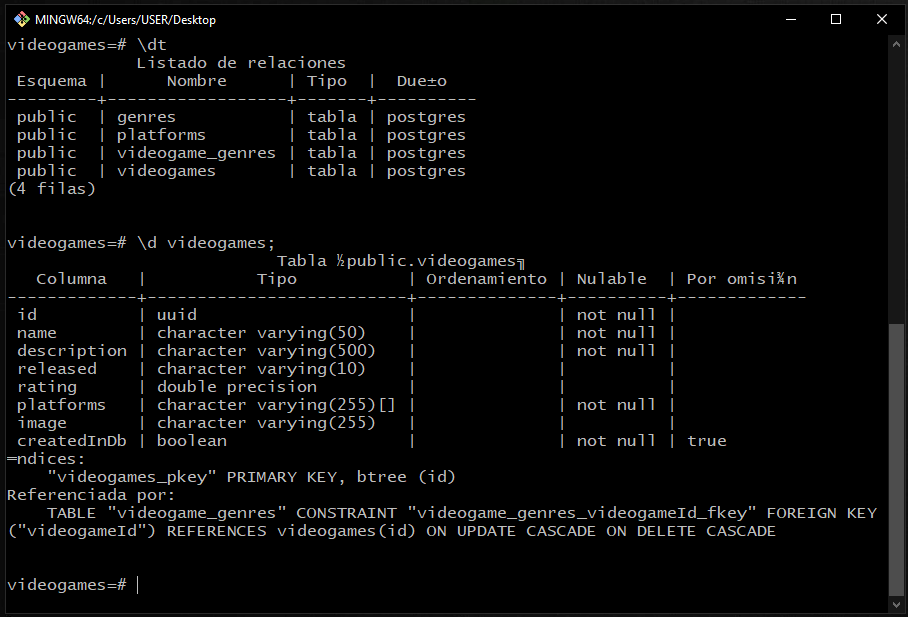
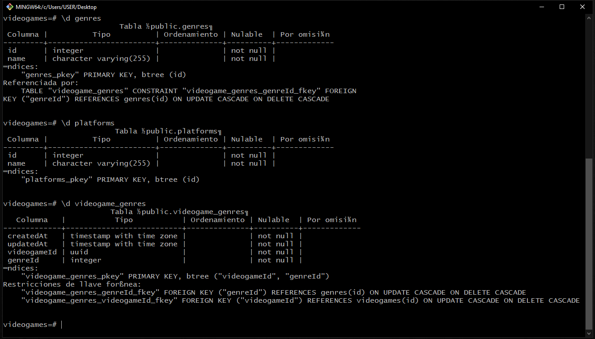
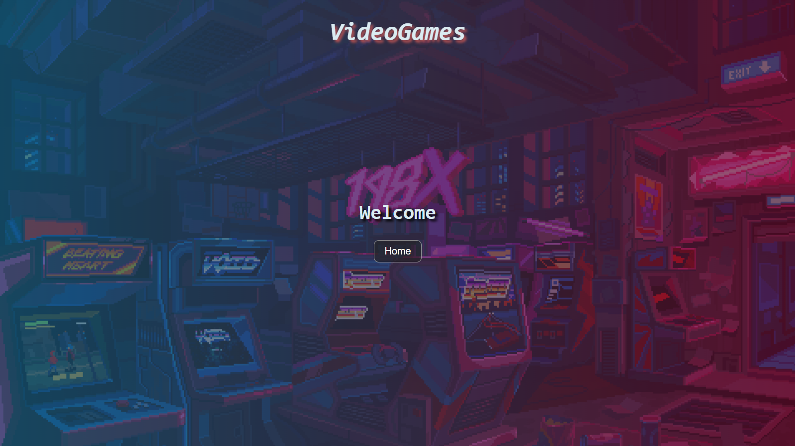
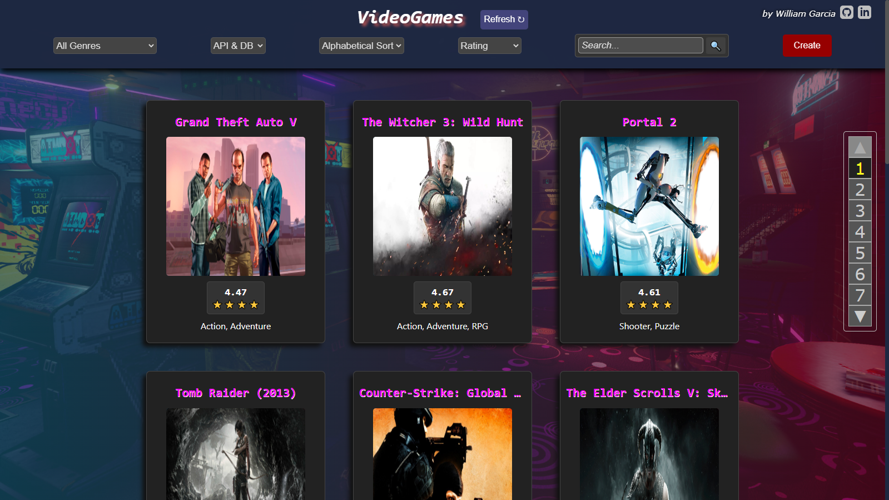
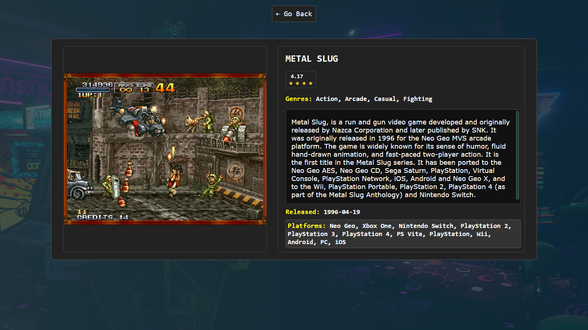
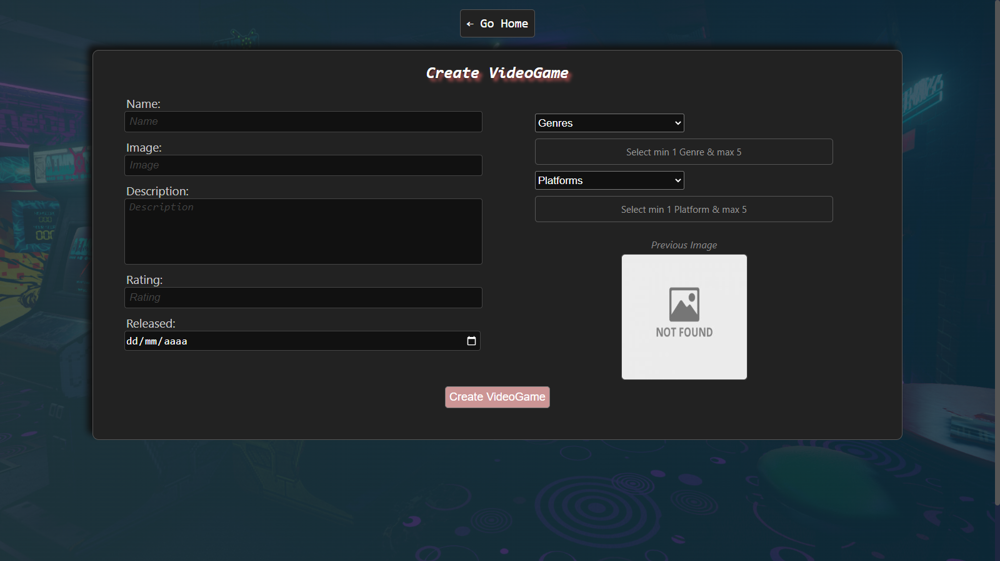

# Project - Videogames App

You can see the finished project here  
👉  👈

### Contact me:

  

---

## Project Details

This App was built using ReactJS, Redux, Node, Sequelize and PostgreSQL.

SPA in which you can see different video games available along with relevant information about them, using the [rawg](https://rawg.io/apidocs) external api and from it you can, among other things:

- Search VideoGames
- Filter / Sort them
- See the detail with information of each video game
- Add new VideoGames

---

<!--
### Endpoints/Flags utilizados de la Api

- GET <https://api.rawg.io/api/games>
- GET <https://api.rawg.io/api/games?search={game}>
- GET <https://api.rawg.io/api/genres>
- GET <https://api.rawg.io/api/games/{id}>
-->

### Technologies

---

## Database

The database model has the following entities:

- [ ] Video game with the following properties:
  - ID: UUIDV4
  - Name
  - Description
  - Released
  - Rating
  - Platforms
- [ ] Genres with the following properties:
  - ID
  - Name
- [ ] Platforms with the following properties:
  - ID
  - Name

The relationship between both entities is many-to-many since a video game can belong to several genres simultaneously and, in turn, a genre can contain multiple different video games. An example would be the game `Counter Strike` belongs to the Shooter and Action genres at the same time. But at the same time there are other video games considered as Shooter or as Action.

---

  

    
  

  

    
  

**NOTE**: When we click on a video game, it can come from the API or the Database, so when its detail is shown there is no ambiguity in which one is shown.

---

## Backend

A server was developed in Node/Express with the following routes:

- [ ] **GET /videogames**:
  - Get a list of video games API + DATABASE
  - Return only the data needed for the parent path
- [ ] **GET /videogames?name="..."**:
  - Obtains a list of the first 15 video games that contain the word entered as a query parameter
  - If there is no video game it shows an error
- [ ] **GET /videogame/{idVideogame}**:
  - Get the detail of a particular video game
  - Obtains only the requested data in the video game detail path
  - Includes associated genres
- [ ] **POST /videogames**:
  - Receive the data collected from the controlled form of the video game creation route by body
  - Create a video game in the database, related to their genres
- [ ] **GET /genres**:
  - Gets all types of video game genres possible
  - In the first instance, they were brought from the rawg API and stored in the database to later be used from there.
- [ ] **GET /platforms**:
  - Gets all types of video game platforms possible
  - In a first instance, they were brought from the rawg API and stored in the database to later be used from there.

## Frontend

Developed a React/Redux app containing the following screens/paths.

**Initial Page**: landing page with

- [ ] A background image representative of the project
- [ ] Button to enter home (`Main Route`)

  

**Main Route**: contains

- [ ] Search input to find video games by name
- [ ] Area where you can see the list of video games. Together with his:
  - Image
  - Name
  - Genres
- [ ] Buttons/Options to filter by genre and by existing video game or added by us (dataBase)
- [ ] Buttons/Options to sort both ascending and descending the video games by alphabetical order and by rating
- [ ] Paginated to search and display the following video games, 15 games per page, showing the first 15 on the first page.

**IMPORTANT**: Since there are around 500,000 games in the API, for performance reasons it was simplified to obtain and page the first 100 video games.

  

**Video game detail path**: contains

- [ ] The fields shown in the main path for each video game (image, name, and genres)
- [ ] Description
- [ ] Released
- [ ] Rating
- [ ] Platforms

  

**Video game creation route**: contains

- [ ] A **JavaScript controlled** form with the following fields:
  - Name
  - Description
  - Released
  - Rating
  - Image - with a preview of the image, in order to validate a correct image.
- [ ] Ability to select/add multiple genres
- [ ] Ability to select/add multiple platforms
- [ ] Button/Option to create a new video game

  

> The creation form is validated with JavaScript and not just with HTML validations.

---
